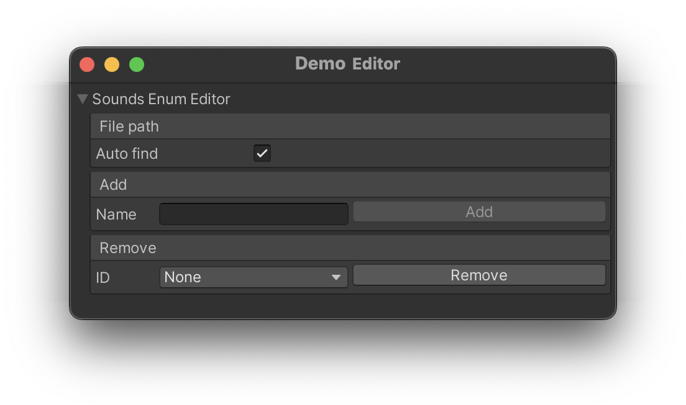

# EnumEditor for Unity
A Serialized Enum Editor for Unity.

[](https://unity3d.com/pt/get-unity/download/archive)
[](https://opensource.org/licenses/MIT)

**Requires Odin Inspector**(
<a href="https://odininspector.com" target="Unity Odin Inspector"></a>)



## 🛠️ Main Features 
- **Easily Add or Remove Enum Entries**: Manage entries with awareness of constant values to keep enums consistent. 
- **Flexible File Path Handling**: Auto-detect enum files or specify the path manually.
- **Odin Inspector Integration**: Powered by Odin for a sleek and user-friendly editor experience.

## ⚙️ Installation 

1. Copy or move the `EnumsEditor` folder into your Unity project's `Assets` folder:
   ```
   Your_Unity_Project/Assets/EnumsEditor
   ```

2. Ensure you have [Odin Inspector](https://odininspector.com/) installed in your project, as it's required for this package.

That's it! You can now start using the Unity Enum Editor to manage your enums. 🎉

## 📝 Usage 
You can easily use the Unity Enum Editor by adding it as a serialized field in your classes wherever you need it.

```csharp MonoBehaviour
public class Demo : MonoBehaviour 
{
    // In MonoBehaviour
    [SerializeField] private EnumEditor<eSound> _soundsEnumEditor;
}
```

```csharp ScriptableObject
[CreateAssetMenu(fileName = "SoundsConfig", menuName = "Configs/Sounds")]
public class SoundsConfig : ScriptableObject
{
    // In ScriptableObject
    [SerializeField] private EnumEditor<eSound> _soundsEnumEditor;
}
```

```csharp OdinEditorWindow
public class SoundsEditorWindow : OdinEditorWindow
{
    // In editor window
    [SerializeField] private EnumEditor<eSound> _soundsEnumEditor;
    
    [MenuItem("Window/Sounds Window")]     
    public static void Open() 
    { 
        GetWindow<SoundsEditorWindow>().Show();
    }
}
```

## Limitations

- Currently, `EnumEditor` does not support constant value types apart from the default `int`.

---

## 📜 License 
This project is licensed under the terms of the [LICENSE](LICENSE) file.

---

Feel free to reach out with any feedback or suggestions! 💬